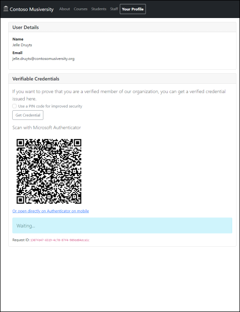
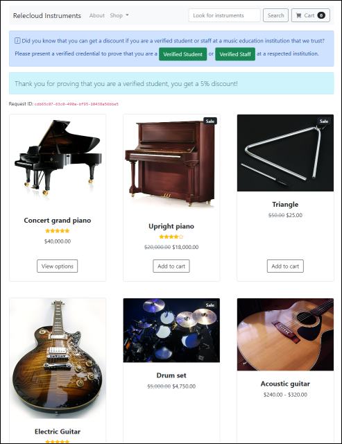

# Identity Sample for Microsoft Entra Verified ID

This sample uses [Microsoft Entra Verified ID](https://docs.microsoft.com/azure/active-directory/verifiable-credentials/) to demonstrate a scenario of two organizations which rely on decentralized identities to create a trust relationship.

**IMPORTANT NOTE: The code in this repository is *not* production-ready. It serves only to demonstrate the main points via minimal working code, and contains no exception handling or other special cases. Refer to the official documentation and samples for more information. Similarly, by design, it does not implement any data persistence (e.g. to a database) to minimize the concepts and technologies being used.**

## Scenario

**Contoso Musiversity** is a university which issues verified credentials to its students and staff. This allows them to present their verified credential to **Relecloud Instruments**, an e-commerce store which trusts that university (and possibly many others) to grant them a special discount of 5% for students and 7% for staff. Because they use verifiable credentials, this can be achieved without traditional federation, exchange of secrets or any other tight coupling between the issuer and verifier of those credentials.

The Contoso Musiversity website allows a user of the organization to sign in, and on their user profile page they can then **issue a verifiable credential** to their wallet application:

The Relecloud Instruments e-commerce store allows any verified student or staff to **present their credential** and receive a discount:

## Setup

Since there are two organizations at play, you would ideally use two separate Azure AD tenants for the issuer (Contoso) and verifier (Relecloud), respectively. If you only have a single Azure AD tenant to try this out with, you can also use that same tenant for both organizations and applications.

### Prepare the issuer tenant

- Follow the documentation to [configure your tenant](https://docs.microsoft.com/azure/active-directory/verifiable-credentials/verifiable-credentials-configure-tenant).
  - Choose a domain name that you control and where you can publish the necessary domain ownership verification files. If you want, the web apps can host the required `/.well-known` endpoints for you, so you don't need anything else to verify the domain. For easy testing you can simply use the default domain provided by your web host, for example `https://<your-app>.azurewebsites.net` when using Azure App Service.
  - Follow the steps to create a Key Vault and set up the Verifiable Credentials service. You can choose either **Web** or **ION** as the trust system. You can skip the section to register an application in Azure AD for now.
- Retrieve the necessary configuration information from the Azure Portal.
  - Under **Organization settings**, copy the **Tenant identifier** and **Decentralized identifier (DID)** values.
  - Under **Registration**, download the `did.json` file for DID registration (only when using the **Web** trust system) and download the `did-configuration.json` file for domain ownership verification (when using either **Web** or **ION**).
- Follow the quickstart to [register an application with Azure AD](https://docs.microsoft.com/azure/active-directory/develop/quickstart-register-app)
  - Give the app a recognizable name such as **Contoso Musiversity** and make it single-tenant (as it's only for the students and staff of Contoso).
  - On the **Authentication** page, ensure to register the redirect URI as a **Single-page application**. This should point at the root of where the web application will be deployed, for example `https://<your-app>.azurewebsites.net`.
  - On the same **Authentication** page, add another platform for **Mobile and desktop applications** and set the **Custom redirect URI** to `vcclient://openid/` (this will be used by the Authenticator app when signing in a verified staff member using the `id_token` flow).
  - On the **Overview** page, copy the **Application (client) ID**.
  - On the **Certificates & secrets** page, create a client secret and copy its value.
  - On the **API permissions** page, [follow the documentation](https://docs.microsoft.com/azure/active-directory/verifiable-credentials/verifiable-credentials-configure-tenant#grant-permissions-to-get-access-tokens) to add a permission for the **Verifiable Credentials Service Request** application (with Application ID `3db474b9-6a0c-4840-96ac-1fceb342124f`), choose the `VerifiableCredential.Create.All` permission and grant admin consent.
- Optional: follow the documentation to [create app roles](https://docs.microsoft.com/azure/active-directory/develop/howto-add-app-roles-in-azure-ad-apps) on the Azure AD app registration.
  - If you don't perform this step, all users in the tenant will simply be considered students.
  - Create one app role with its **Value** set to `Student` and another one for `Staff`.
  - [Assign some users to either of these roles](https://docs.microsoft.com/azure/active-directory/develop/howto-add-app-roles-in-azure-ad-apps#assign-users-and-groups-to-roles); depending on their role they will be issued a **Verified Student** or **Verified Staff** credential in the web application.

### Prepare the verifier tenant

Repeat the same process for the verifier tenant (Relecloud). For the app registration of the **Relecloud Instruments** web application in Azure AD, you don't need the `vcclient://openid/` redirect URI or any app roles.

### Deploy the web applications

The two web applications are based on cross-platform ASP.NET Core. You can compile the [source code](./src) and publish the app to your web host of choice directly, or build and run it as a container.

Alternatively, you can always find the latest published version of the web apps as pre-built Docker containers on the **GitHub packages container registry** and deploy them directly to your preferred container platform:

- **[ghcr.io/jelledruyts/contosomusiversity:latest](https://ghcr.io/jelledruyts/contosomusiversity:latest)**.
- **[ghcr.io/jelledruyts/relecloudinstruments:latest](https://ghcr.io/jelledruyts/relecloudinstruments:latest)**.

To make things even easier, you can also deploy the two web apps to Azure App Service directly using the button below, which allows you to provide the necessary [configuration settings](#configuration-settings) you gathered in the previous steps directly during deployment:

### Complete registration of the issuer and verifier tenants

If you had downloaded the `did.json` (Web) and `did-configuration.json` (Web/ION) files and provided their contents as configuration for the web apps, you should now have the necessary `/.well-known` endpoints available on your chosen domain, for example `https://<your-app>.azurewebsites.net/.well-known/did.json`. On the Verified ID's **Registration** page of the issuer and verifier tenants, you should now be able to complete the DID registration (Web) and Domain ownership verification (Web/ION).

### Create the verified credentials

- On the issuer tenant, go to the Verified ID's **Credentials** page and create a **Custom credential** for verified students (which uses the [`id_token_hint` flow](https://docs.microsoft.com/azure/active-directory/verifiable-credentials/how-to-use-quickstart)).
  - Set the **credential name** to `Verified Student`.
  - For the **display definition**, use the contents of the [Student-DisplayDefinition.json](src/ContosoMusiversity/CredentialFiles/Student-DisplayDefinition.json) file and replace the logo's `uri` with the right value depending on where you've hosted the web app, for example `https://<your-app>.azurewebsites.net/logo.png`.
  - For the **rules definition**, use the contents of the [Student-RulesDefinition.json](src/ContosoMusiversity/CredentialFiles/Student-RulesDefinition.json) file.
- Create a **Custom credential** for verified staff (which uses the `id_token` flow).
  - Set the **credential name** to `Verified Staff`.
  - For the **display definition**, use the contents of the [Staff-DisplayDefinition.json](src/ContosoMusiversity/CredentialFiles/Staff-DisplayDefinition.json) and again set the appropriate logo URI.
  - For the **rules definition**, use the contents of the [Staff-RulesDefinition.json](src/ContosoMusiversity/CredentialFiles/Staff-RulesDefinition.json) file, and replace the following to configure the [`id_token` flow](https://docs.microsoft.com/azure/active-directory/verifiable-credentials/how-to-use-quickstart-idtoken):
    - In the `configuration` property, set the `<tenant-id>` to the Azure AD tenant ID.
    - Set the `clientId` property to the client ID of the **Contoso Musiversity** app registration.

### Try it out

You can now navigate to the **Contoso Musiversity** web app, sign in with any user in the issuer tenant, and request a verified credential to be issued to your wallet. Depending on the app role of the user you will get a **Verified Student** or **Verified Staff** credential.

You can then navigate to the **Relecloud Instruments** application and present your verified credential, at which point you'll get a different discount depending on whether you're a student or staff.

## Configuration Settings

The apps can be configured with the configuration settings below, using environment variables or typically the app settings of your hosting platform of choice.

### Common Settings

| App Setting                                              | Deployment Parameter                       | Portal Location                                                                     | Default Value                                   | Purpose                                                                                                                                                                                                               |
| -------------------------------------------------------- | ------------------------------------------ | ----------------------------------------------------------------------------------- | ----------------------------------------------- | --------------------------------------------------------------------------------------------------------------------------------------------------------------------------------------------------------------------- |
| `EntraVerifiedId__TenantId`                              | Tenant Id                                  | Verified ID / Organization settings / Tenant identifier                             |                                                 | The unique identifier of the tenant which hosts the Verifiable Credentials Request Service.                                                                                                                           |
| `EntraVerifiedId__Instance`                              |                                            |                                                                                     | `https://login.microsoftonline.com/`            | Used by MSAL.js to sign users in to the right Azure AD "instance".                                                                                                                                                    |
| `EntraVerifiedId__DidInstance`                           |                                            |                                                                                     | `https://verifiedid.did.msidentity.com/v1.0`    | Identifies the endpoint to use for the Verifiable Credentials Request Service.                                                                                                                                        |
| `EntraVerifiedId__DidAuthority`                          | Did Authority                              | Verified ID / Organization settings / Decentralized identifier (DID)                |                                                 | Uniquely identifies your organization to other parties.                                                                                                                                                               |
| `EntraVerifiedId__WellKnownDidJsonContents`              | Well Known Did Json Contents               | Verified ID / Registration / DID registration / did.json                            |                                                 | Exposes the value as `/.well-known/did.json`, which is used for DID registration.                                                                                                                                     |
| `EntraVerifiedId__WellKnownDidConfigurationJsonContents` | Well Known Did Configuration Json Contents | Verified ID / Registration / Domain ownership verification / did-configuration.json |                                                 | Exposes the value as `/.well-known/did-configuration.json`, which is used for domain ownership verification.                                                                                                          |
| `EntraVerifiedId__ClientId`                              | Client Id                                  | App Registration / Overview / Application (client) ID                               |                                                 | The client ID of the application requesting access tokens for the Verifiable Credentials Request Service.                                                                                                             |
| `EntraVerifiedId__ClientSecret`                          | Client Secret                              | App Registration / Certificates & secrets                                           |                                                 | The client secret of the application requesting access tokens for the Verifiable Credentials Request Service.                                                                                                         |
| `EntraVerifiedId__ClientName`                            |                                            |                                                                                     | `Contoso Musiversity` / `Relecloud Instruments` | Identifies the application accessing the Verifiable Credentials Request Service.                                                                                                                                      |
| `EntraVerifiedId__ApiKey`                                | Api Key                                    |                                                                                     |                                                 | Used to secure communications between the web application and the Verifiable Credentials Request Service, you can set this to a new GUID for example.                                                                 |
| `EntraVerifiedId__PinLength`                             |                                            |                                                                                     | `null`                                          | Used by the issuer only in case you want to force usage of a PIN code (enter a number between 4 and 16).                                                                                                              |
| `EntraVerifiedId__IncludeReceipt`                        |                                            |                                                                                     | `false`                                         | Used by the verifier only in case you want to receive a [receipt](https://docs.microsoft.com/azure/active-directory/verifiable-credentials/presentation-request-api#requestpresentation-type) with debug information. |

### Contoso Musiversity Settings

| App Setting                                         | Portal Location                                     | Default Value      | Purpose                                                                                                                         |
| --------------------------------------------------- | --------------------------------------------------- | ------------------ | ------------------------------------------------------------------------------------------------------------------------------- |
| `ContosoMusiversity__StudentAppRoleName`            | App Registration / App roles / Student role / Value | `Student`          | The **Value** of the student app role.                                                                                          |
| `ContosoMusiversity__StaffAppRoleName`              | App Registration / App roles / Staff role / Value   | `Staff`            | The **Value** of the staff app role.                                                                                            |
| `ContosoMusiversity__StudentCredentialType`         | Verified ID / Credentials / Verified Student        | `Verified Student` | The name of the student credential.                                                                                             |
| `ContosoMusiversity__StaffCredentialType`           | Verified ID / Credentials / Verified Staff          | `Verified Staff`   | The name of the staff credential.                                                                                               |
| `ContosoMusiversity__VerifiedCredentialInputClaims` |                                                     | `email, name`      | The (comma-separated) input claims for the student which are sent as part of the issuance request for the `id_token_hint` flow. |

### Relecloud Instruments Settings

| App Setting                                      | Portal Location                                                             | Default Value      | Purpose                                                                    |
| ------------------------------------------------ | --------------------------------------------------------------------------- | ------------------ | -------------------------------------------------------------------------- |
| `RelecloudInstruments__VerifiedCredentialIssuer` | Issuer Verified ID / Organization settings / Decentralized identifier (DID) |                    | The unique Decentralized identifier (DID) of the trusted issuer (Contoso). |
| `RelecloudInstruments__StudentCredentialType`    | Issuer Verified ID / Credentials / Verified Student                         | `Verified Student` | The name of the student credential as defined by the issuer (Contoso).     |
| `RelecloudInstruments__StaffCredentialType`      | Issuer Verified ID / Credentials / Verified Staff                           | `Verified Staff`   | The name of the staff credential as defined by the issuer (Contoso).       |

## License

This project is licensed under the MIT License - see the [LICENSE](LICENSE) file for details.
